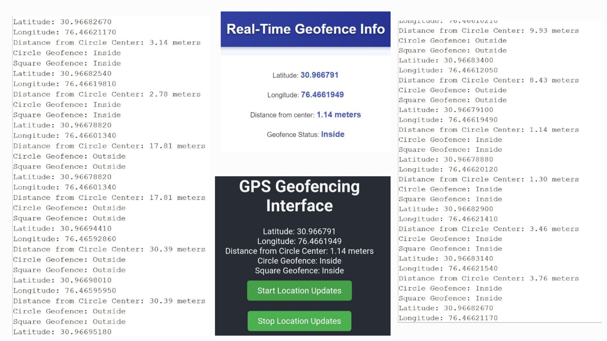
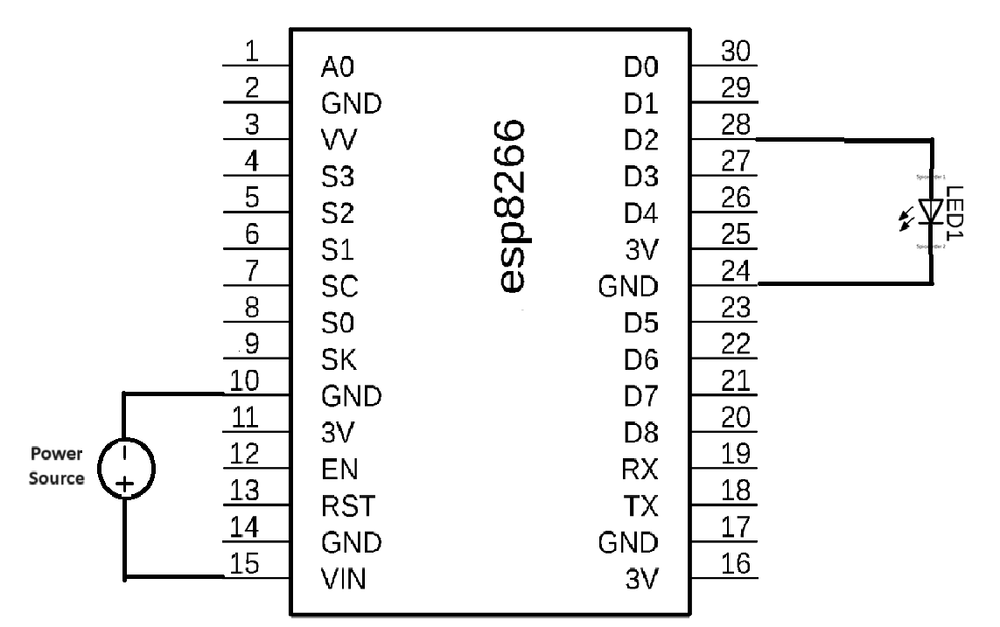

# 🌐 GPS-Enabled Geofencing System with ESP8266

**Contributors:**

* Parth Kulkarni (2023CSB1142)
* Harsh Rai (2023CSB1345)
* Nitin Kumar (2023CSB1141)
* Raghav Jha (2023CSB1149)
* Bhavya Rao (2023CSB1291)

---


## 📌 Project Overview

This project implements a **real-time location tracking and geofencing system** using the **ESP8266 module**. It integrates GPS data, web technologies, and a buzzer-based alert system to monitor and respond to geofence boundary violations.



The system is highly scalable and supports monitoring of multiple devices—ideal for applications like **personal safety**, **fleet management**, and **asset tracking**.

---

## 🚀 Features

1. **Real-Time Location Tracking** — Continuous GPS data acquisition and transmission.
2. **Interactive Web Interface** — Live location visualization with configurable geofence boundaries.
3. **Geofencing & Alerts** — Triggers buzzer alerts and notifications on boundary violation.
4. **Admin Dashboard** — Monitor all connected devices with real-time status and alerts.
5. **Notification System** — Supports configurable email or SMS alerts.
6. **Scalability** — Built to manage multiple devices efficiently.

---

## 🧩 System Architecture

The system is composed of the following components:

### 1. 📱 Mobile Device

* Captures real-time GPS coordinates.
* Sends location data to ESP8266 over the internet.

### 2. 📶 ESP8266 Module

* Acts as the central communication hub.
* Sends GPS data to a web server using HTTP.
* Implements geofencing logic and triggers alerts.



### 3. 🖥 Web Interface

* Displays real-time locations on an interactive map.
* Allows users to configure geofencing rules and view alerts.

### 4. 🔊 Buzzer System

* Provides audible alerts for geofence violations.

### 5. 🛠 Secondary Web Interface (Admin Dashboard)

* Displays the status of all devices.
* Tracks geofence compliance and recent activity logs.

---

## 🔄 Workflow

1. **Location Data Acquisition** — Mobile device captures GPS coordinates.
2. **Data Transmission** — GPS data is sent to ESP8266 via the internet.
3. **HTTP Forwarding** — ESP8266 sends this data to a web server in JSON format.
4. **Live Visualization** — Web interface displays real-time data and geofence status.
5. **Geofencing Enforcement** — ESP8266 monitors boundaries and triggers alerts on violation.
6. **Admin Dashboard** — Displays device list, last known locations, and alerts.
7. **Notification Handling** — Email or SMS alerts are sent for critical boundary events.

---

## ✅ Benefits

* **Reliable Data Transmission** — Consistent communication via Wi-Fi and HTTP.
* **User-Friendly Interfaces** — Web-based control and monitoring.
* **Immediate Alerts** — Buzzer + notification alerts ensure rapid awareness.
* **Scalable Design** — Works seamlessly with multiple devices and sessions.

---

## 📦 Applications

* 🚚 Fleet Management
* 🧍 Personal Safety
* 📦 Asset Tracking
* 🏭 Supply Chain Monitoring

---

## 🔧 How to Use

1. Modify the provided ESP8266 code with your Wi-Fi SSID and password.
2. Upload the code to the ESP8266 and power it on.
3. Open the **Serial Monitor** — it will display the local IP address assigned.
4. Use [ngrok](https://ngrok.com/) to expose the local IP:

   ```bash
   ngrok http http://<ESP_LOCAL_IP>
   ```
5. Share the public ngrok URL for location tracking access.
6. To access real-time monitoring, append `/info` to the URL:

   ```
   https://your-ngrok-url.ngrok.io/info
   ```

---

This **GPS-enabled geofencing system** blends **IoT**, **GPS**, and **web technology** to deliver a robust, scalable, and user-friendly solution for real-time location tracking and geofence enforcement.

